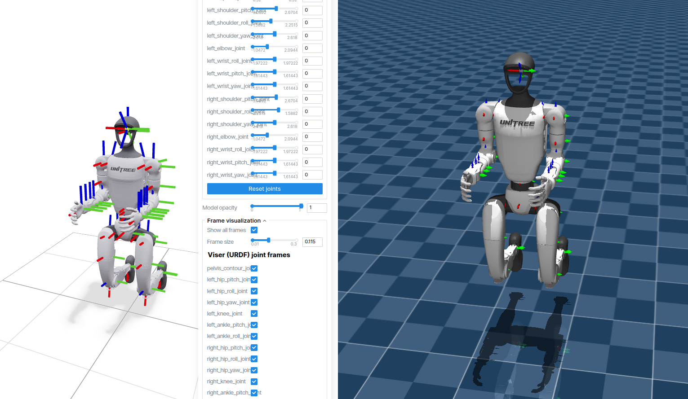

# tbai_mujoco_descriptions

Robot MuJoCo (MJCF) descriptions and interactive visualizer.

<div align="center">

</div>

## Setup

```bash
git clone --recurse-submodules git@github.com:tbai-lab/tbai_mujoco_descriptions.git
```

## Usage

```bash
uv run python visualize_mjcf.py              # list available robots
uv run python visualize_mjcf.py --robot go2   # visualize specified robot
```

## Robots

<div align="center">

| Robot | Description | Reference | License |
|-------|-------------|-----------|---------|
| [__G1__](robots/g1/) | 29-DoF humanoid from Unitree Robotics | [Link](https://www.unitree.com/) | - |
| [__Go2__](robots/go2/) | 12-DoF quadruped from Unitree Robotics | [Link](https://www.unitree.com/) | - |
| [__Go2W__](robots/go2w/) | 16-DoF wheeled version of Go2 | [Link](https://www.unitree.com/) | - |

</div>
